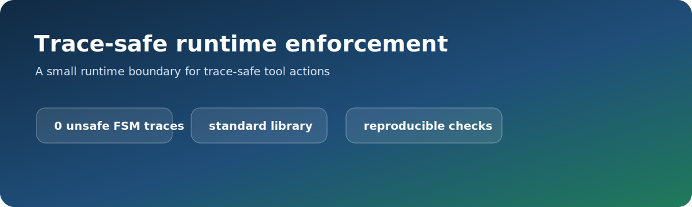
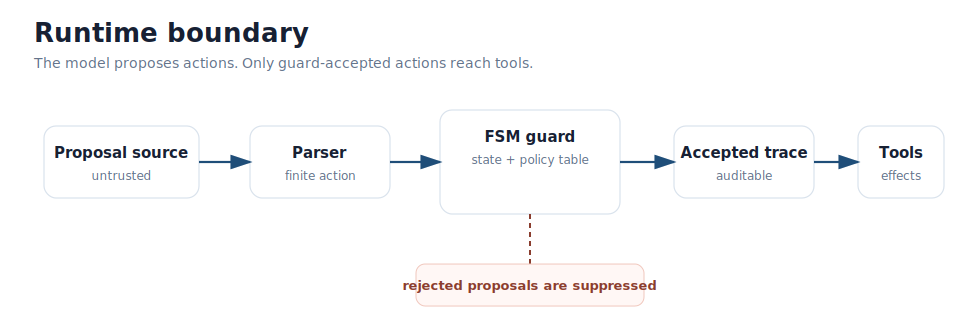
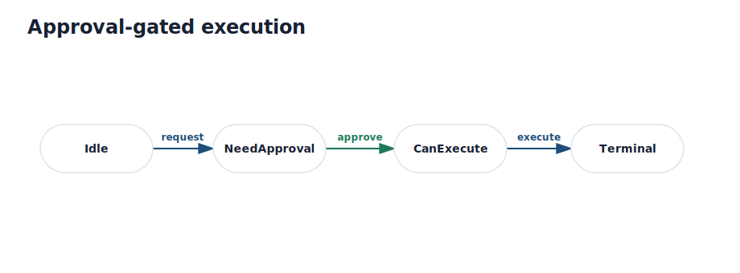
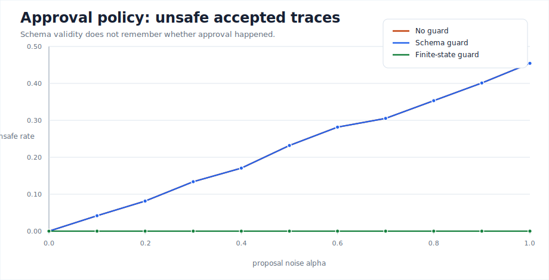
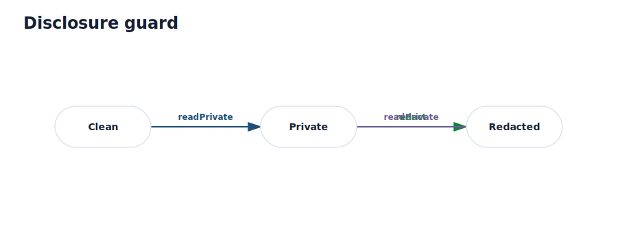
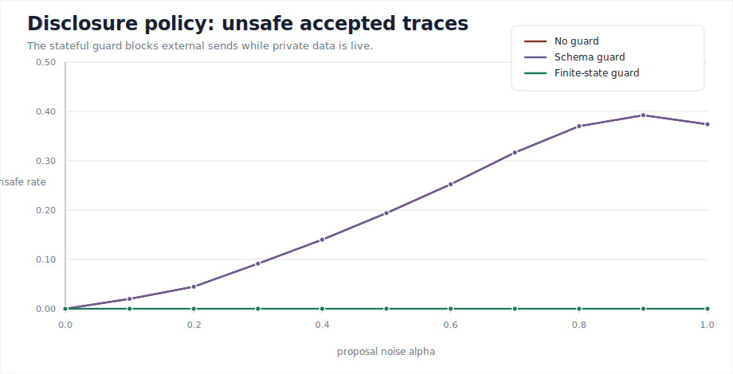
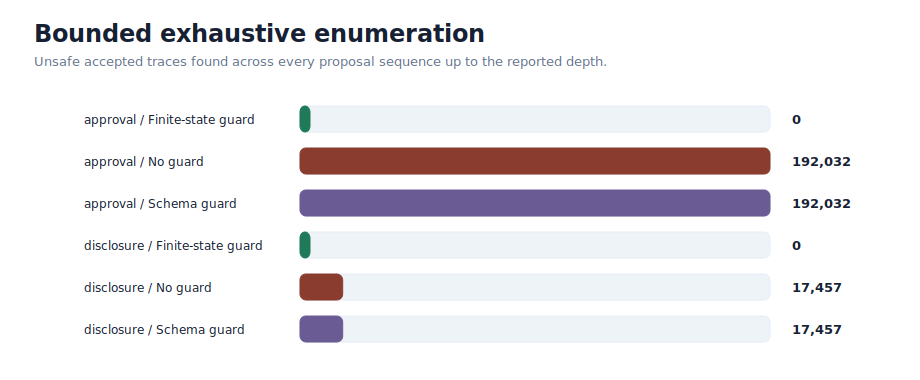
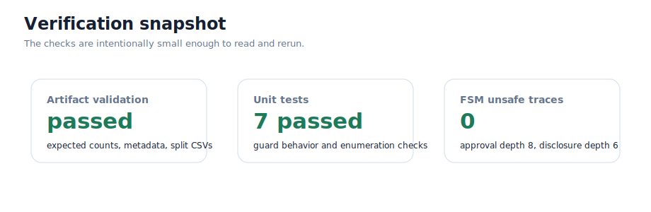

<p align="center">
  
</p>

# Trace-Safe Runtime Enforcement Artifact

This repository is a small, reproducible artifact for testing a simple idea:
when a tool-using model proposes actions, a deterministic finite-state guard can
decide which actions are allowed to reach the tool layer.

The artifact compares three execution surfaces:

| Controller | What it checks | What it misses |
| --- | --- | --- |
| No guard | Nothing | Everything unsafe can be emitted |
| Schema guard | Whether an action name is valid | Whether the action is valid *now* |
| Finite-state guard | Action name and workflow state | Progress still depends on good proposals |

The finite-state guard is intentionally small. Its job is not to make a model
smart or aligned. Its job is to enforce a trace policy at the boundary where
proposed actions become external effects.

<p align="center">
  
</p>

## Why this exists

Tool calls are not just text. A valid-looking action can still be unsafe when it
appears in the wrong state:

- `execute` before `approve`
- `sendExternal` while private data is still live
- `deploy.production` before CI and human approval
- a malformed proposal sent straight through to a tool adapter

Schema validation catches malformed calls. It does not remember history. This
artifact shows the difference between *valid syntax* and *safe accepted traces*
with reproducible simulations, adversarial examples, exhaustive enumeration, and
machine-readable proof-obligation rows.

## Repository contents

```text
.
├── run_guarded_fsm_sim.py              # policies, controllers, sweeps, reports
├── artifact/
│   ├── run_all.py                      # full reproduction wrapper
│   ├── validate_artifact.py            # deterministic validation checks
│   ├── EXPECTED_RESULTS.json
│   ├── policies/
│   └── tests/
├── docs/assets/                        # generated SVG diagrams and charts
├── scripts/make_readme_assets.py       # rebuilds the README images
└── guarded_fsm_*                       # generated CSVs, metadata, and report
```

Requires Python 3.10 or newer; the continuous-integration workflow tests on
Python 3.12. No third-party Python packages are required.

## Journal artifact release

The citable pre-submission release for the accompanying Journal of Systems and
Software manuscript is:

- Release: <https://github.com/M3RCU3Y/guarded-fsm-trace-safety/releases/tag/v1.0.0-pre-submission>
- Attached journal supplement: `jss_supplementary_artifact.zip`
- Supplement SHA-256:
  `acd984345efed0fcf62cbaed81ac8aa66e3451a7b4b674b4a0f7b8ef7cf19c02`
- Version: `1.0.0-pre-submission`
- Release date: 2026-05-25
- Runtime dependencies: Python standard library only
- Primary reproduction command: `python artifact/run_all.py`

The release is intended to support the manuscript "Finite-State Runtime
Enforcement for Trace-Safe LLM Tool Use." It includes generated CSV evidence,
policy JSON files, validation checks, unit tests, proof-obligation rows, and
the deployment parser-boundary cases cited by the paper. Citation metadata is
provided in `CITATION.cff`.

## Quick start

```bash
python artifact/run_all.py
```

That command regenerates the result CSVs, policy JSON files, metadata, and
summary report; validates the expected results; and runs the unit tests.

For a faster smoke run:

```bash
python run_guarded_fsm_sim.py --quick
python artifact/validate_artifact.py --quick
python -m unittest discover -s artifact/tests -p "test_*.py"
```

To rebuild the README charts and diagrams:

```bash
python scripts/make_readme_assets.py
```

## Worked guards

### Approval-gated execution

The approval guard enforces:

> `execute` must never be accepted before `approve`.

<p align="center">
  
</p>

Schema validation knows that `execute` is a valid action name. The finite-state
guard also knows whether the workflow has reached `CanExecute`.

<p align="center">
  
</p>

### Disclosure guard

The disclosure guard enforces:

> `sendExternal` must not be accepted while the trace is inside an unredacted
> private-data interval.

<p align="center">
  
</p>

The stateful guard blocks external sends while private data is live, and allows
them again after redaction or clearing.

<p align="center">
  
</p>

### Deployment parser-boundary case

The deployment case starts from raw JSON-like tool calls and maps them into a
finite alphabet before mediation:

```text
open_pr -> ci_passed -> human_approve -> deploy_prod -> rollback
```

The finite-state guard blocks production deployment unless CI has passed and a
human approval has been recorded. The generated
`guarded_fsm_deployment_parser_cases.csv` file includes malformed JSON,
prompt-injected deployment, and safe rollback examples.

## Results at a glance

### Integrated sweep metrics

| Policy | Controller | Unsafe AUC | Success AUC | Mean-blocked AUC |
| --- | --- | ---: | ---: | ---: |
| Approval | No guard | 0.223 | 0.368 | 0.000 |
| Approval | Schema guard | 0.223 | 0.368 | 0.593 |
| Approval | Finite-state guard | **0.000** | **0.804** | 2.183 |
| Disclosure | No guard | 0.201 | 0.328 | 0.000 |
| Disclosure | Schema guard | 0.201 | 0.328 | 1.003 |
| Disclosure | Finite-state guard | **0.000** | **0.367** | 2.003 |

The no-guard and schema-only baselines have the same unsafe AUC in both
policies. Schema validation removes malformed proposals, but it does not enforce
history-sensitive safety.

### Exhaustive enumeration

The artifact also enumerates every proposal sequence up to the configured
depths:

<p align="center">
  
</p>

| Policy | Depth | Sequences checked | Unsafe sequences with FSM guard |
| --- | ---: | ---: | ---: |
| Approval | 8 | 390,625 | **0** |
| Disclosure | 6 | 117,649 | **0** |

The baselines intentionally fail here. That is useful: the counterexamples are
small and inspectable.

## Testing snapshot

<p align="center">
  
</p>

The test suite covers:

- direct approval and disclosure guard behavior
- deployment parser-boundary behavior
- schema-only baseline failures
- bounded finite-state enumeration
- generated proof-obligation rows
- expected-result validation

Run it directly:

```bash
python -m unittest discover -s artifact/tests -p "test_*.py"
```

## Generated files

| File | Purpose |
| --- | --- |
| `guarded_fsm_sim_results.csv` | Approval-policy sweep |
| `guarded_fsm_disclosure_results.csv` | Disclosure-policy sweep |
| `guarded_fsm_deployment_parser_cases.csv` | Raw deployment parser-boundary cases |
| `guarded_fsm_enumeration_results.csv` | Bounded exhaustive enumeration |
| `guarded_fsm_adversarial_traces.csv` | Minimal adversarial proposal traces |
| `guarded_fsm_proof_obligations.csv` | State/action proof-obligation rows |
| `guarded_fsm_overhead_results.csv` | Guard-decision timing sanity check |
| `guarded_fsm_artifact_metadata.json` | Reproduction parameters and platform |
| `guarded_fsm_artifact_report.md` | Generated summary report |

## What to inspect first

1. `run_guarded_fsm_sim.py` for the policy definitions and controller logic.
2. `artifact/tests/test_guarded_fsm_artifact.py` for the behavioral checks.
3. `guarded_fsm_proof_obligations.csv` for the finite state/action audit rows.
4. `guarded_fsm_adversarial_traces.csv` for the smallest baseline failures.

## Design notes

- The guard suppresses rejected proposals. It does not repair them or replace
  them with fallback actions.
- The proposal source is deliberately arbitrary. The guarantee is attached to
  the accepted trace, not to the model's internal behavior.
- The state abstraction must remember every history feature needed by the
  policy. If the state forgets something safety-relevant, the guard is proving
  the wrong thing.
- The artifact is deterministic except for the machine-dependent timing values
  in `guarded_fsm_overhead_results.csv`.

## License

MIT. See `LICENSE`.
